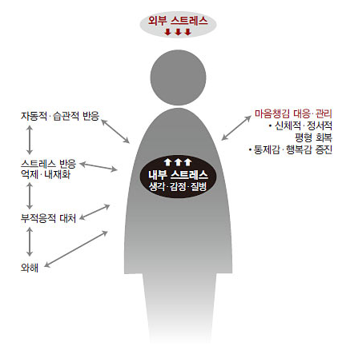
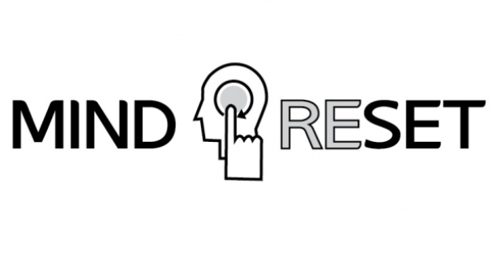

## 스토리보드
```
안녕하세요, 마인드핏에 오신 걸 환영해요.
요즘 머릿속이 복잡해서 아무것도 손에 안 잡힐 때 있지 않나요?
생각은 많은데 정작 아무것도 못 하는 느낌… 오늘은 그런 당신을 위해 준비했어요.
단 10분이면 가능한 마인드 리셋 루틴.
이 시간을 지나고 나면, 머릿속이 조금은 가벼워질 거예요.
우리 뇌는 스마트폰처럼 하루 종일 알림을 받고 있어요.
학교 숙제, 시험 일정, 친구 관계, SNS 소식…
심지어 자려고 누웠을 때조차
‘내일 뭐 입지’, ‘이번 시험 망하면 어떡하지’ 같은 생각이 쉼 없이 올라오죠.
이런 상태를 **과잉 각성(over-arousal)**이라고 해요.
뇌가 계속 ‘위험할지도 몰라’ 모드로 작동해서
작은 일에도 예민해지고, 쉽게 지치고, 집중력도 떨어져요.
이럴 때 필요한 건, ‘멍하니 쉬기’가 아니에요.
오히려 의도적으로 멈추고, 정리하고, 리셋하는 시간이 필요해요.지금부터 10분짜리 루틴을 소개할게요.
준비물은 오직, 당신 자신뿐입니다.
먼저 편안히 앉아주세요. 눈은 감아도, 뜨고 있어도 괜찮아요.
숨을 천천히 들이마시고… (3초) … 천천히 내쉬어요. (4초)
이 호흡을 5번 반복해요.
당신의 어깨가 조금씩 내려가는 걸 느껴보세요.
머릿속 소음은 잠시 뒤로 미뤄두고요.
이제 머릿속에 떠오르는 생각을 한 가지씩 꺼내볼게요.
무엇이든 괜찮아요.
‘오늘 과제 하기 싫다’, ‘친구가 내 메시지 읽씹했다’…
그런 생각이 떠오르면, 그저 이렇게 중얼쳐요.
‘아, 이런 생각이 있구나.’
판단하지 말고, 그냥 지나가는 구름처럼 바라보세요.
당신은 그 생각이 아니고,
그저 그 생각을 지켜보는 사람이에요.
이제 눈을 살며시 뜨고, 근처에 있는 메모장이나 휴대폰 메모장을 켜보세요.
지금 이 순간 느껴지는 걸 한 줄로 써보는 거예요.
예: ‘지금 심장이 조금 빨리 뛴다’, ‘의자가 따뜻하다’, ‘조용하다’
생각이 아니라, 감각에 집중해보세요.
지금 이 순간 당신이 ‘살아있다’는 걸 글자로 남기는 거예요.
이제 마지막이에요.
당신이 스스로에게 해주고 싶은 말을 한 마디 떠올려보세요.
예: ‘지금 이대로도 괜찮아.’
‘나는 다시 시작할 수 있어.’
마음속으로 조용히 되뇌어요.
이 문장이 오늘 하루의 나침반이 될 거예요.
자, 10분이 지났어요.
지금 어떤가요?
머릿속이 조금은 덜 복잡해졌길 바라요.
이 루틴은 매일 해도, 가끔만 해도 괜찮아요.
중요한 건 ‘마음을 돌볼 수 있다’는 걸 스스로에게 알려주는 거니까요.
오늘 들려드린 마인드 리셋 루틴은
PDF로도 정리해두었으니, 마인드핏 채널 커뮤니티에서 확인하실 수 있어요.
그리고, 여러분의 이야기도 듣고 싶어요.
당신만의 리셋 루틴이 있다면 마인드핏에 공유해주세요.
다음 에피소드에서 소개해드릴게요.마음이 무거울 땐, 잠깐 멈추고 리셋하기.
이건 게으른 게 아니라, 내일을 살아갈 힘을 충전하는 거예요.
당신의 마음 근육을 키우는 시간,
여기는 마인드핏이었습니다.
다음 시간에 만나요.
```

## 캐릭터 자료
[수달](https://labs.google/fx/tools/whisk/share/78rv9dh9o0000)
[부엉이](https://labs.google/fx/tools/whisk/share/5m99k6jrg0000)

## 이미지 자료
[이미지1]
[이미지2]
